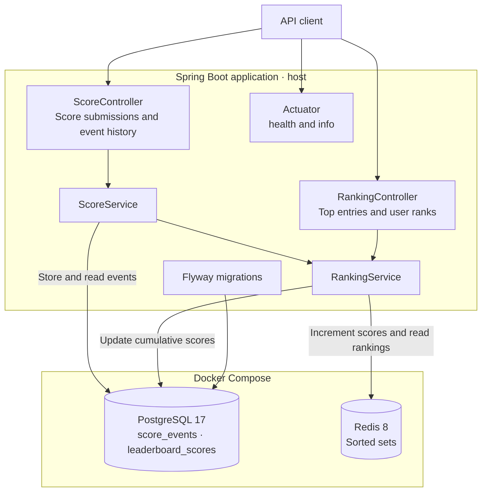

# Leaderboard Service – Score Tracking & Rankings API

A Java / Spring Boot REST API for recording score events and maintaining leaderboards. PostgreSQL stores event history and cumulative scores, while Redis sorted sets serve ranking queries.

## 🚀 Features

- 🏆 Separate leaderboards identified by `leaderboardId`
- ➕ Score updates that accumulate points for each user
- 📜 Per-user score event history with event and creation timestamps
- ⚡ Redis-backed top-N queries and individual ranks starting at 1
- 🗄️ PostgreSQL persistence with automatic Flyway migrations
- ✅ Request validation and structured `ProblemDetail` error responses
- 🩺 Health and information endpoints through Spring Boot Actuator
- 🐳 Fully containerized setup with Docker Compose for the Spring Boot application, PostgreSQL, and Redis


## 🌐 Live Demo

No public demo URL is documented in the repository. The local API uses [http://localhost:8080](http://localhost:8080) after successful startup. This project exposes a REST API; it does not include a browser UI.

## 🏗️ Architecture

The application is organized into two main modules:

- **Score**: accepts score events and retrieves a user's event history.
- **Ranking**: maintains cumulative scores and reads leaderboard positions from Redis.

Each score submission saves an event in `score_events`, updates the user's total in `leaderboard_scores`, and increments the corresponding Redis sorted-set member. Redis keys use the format `leaderboard:{leaderboardId}:scores`.

PostgreSQL and Redis run in Docker containers. The Spring Boot application runs separately on the host and connects through the published database ports. PostgreSQL writes use a transaction; Redis updates are separate from that database transaction. Automatic Redis rebuilding or reconciliation is not currently implemented.

## 📊 Architecture Diagram



## 📦 Tech Stack

- Java 25 / Spring Boot 4.1.0
- Spring Web MVC / Jakarta Bean Validation
- Spring Data JPA / Hibernate / PostgreSQL 17
- Spring Data Redis / Redis 8
- Flyway / Spring Boot Actuator
- Gradle 9.5.1 wrapper
- JUnit Jupiter / Mockito / AssertJ
- Docker / Docker Compose

## ⚡ Getting Started

### Prerequisites

- JDK 25, with `JAVA_HOME` configured
- Docker and Docker Compose
- Git

The Gradle wrapper is included; a separate Gradle installation is not required. The commands below use Bash. On Windows, use Git Bash or replace `bash ./gradlew` with `.\gradlew.bat` in PowerShell.

### 1. Clone the repository

```bash
git clone https://github.com/MaleevFedor/leaderboard-service.git
cd leaderboard-service
```

### 2. Configure environment variables

Copy the supplied example to the project root:

```bash
cp env/example.env .env
```

The example contains local development settings:

```dotenv
DATABASE_NAME=leaderboard
DATABASE_USERNAME=leaderboard
DATABASE_PASSWORD=leaderboard
DATABASE_URL=jdbc:postgresql://localhost:5432/leaderboard
```

Docker Compose reads `.env` automatically. Spring Boot uses matching defaults from [`application.properties`](src/main/resources/application.properties), so the unchanged example needs no additional application configuration.

If you customize these values, also set `DATABASE_URL`, `DATABASE_USERNAME`, and `DATABASE_PASSWORD` in the environment of the shell or IDE that starts Spring Boot; it does not automatically load this `.env` file. Keep the database name in `DATABASE_URL` consistent with `DATABASE_NAME`. The Compose PostgreSQL health check hardcodes the `leaderboard` user and database, so update it too if either changes. Redis defaults to `localhost:6379` and can be configured with `REDIS_HOST` and `REDIS_PORT`.

### 3. Start Docker Compose

```bash
docker compose up --build
```

Wait for PostgreSQL to become healthy.

### 4. Start the application

Resolve the duplicate controller mapping described above, then run:

```bash
bash ./gradlew bootRun
```

Flyway applies the SQL migrations in `src/main/resources/db/migration` during startup. Hibernate validates the resulting schema, so no separate migration command is needed.

### 5. Check the application

- **API base:** [http://localhost:8080/api/leaderboard](http://localhost:8080/api/leaderboard) — append a leaderboard ID and endpoint from the table below.
- **Health:** [http://localhost:8080/actuator/health](http://localhost:8080/actuator/health)
- **Info:** [http://localhost:8080/actuator/info](http://localhost:8080/actuator/info)

### 6. Stop the application and containers

Stop `bootRun` with `Ctrl+C`, then run:

```bash
docker compose down
```

The named PostgreSQL and Redis volumes retain their data. Redis is configured with append-only persistence.

## 🔌 API Usage

All leaderboard routes share the base path `/api/leaderboard/{leaderboardId}`. These are the declared routes; the startup conflict must be resolved before any endpoint is available.

| Method | Endpoint | Purpose |
| --- | --- | --- |
| `POST` | `/add-score` | Record a score delta and update the cumulative total; returns `201 Created`. |
| `GET` | `/user/{userId}/get-events` | Retrieve the user's score event history. |
| `GET` | `/top?limit=5` | Return the highest-scoring entries; the default limit is 5. |
| `GET` | `/user/{userId}/get-rank` | Return the user's rank, starting at 1; currently conflicts with the around-user handler. |

The around-user handler accepts a `radius` parameter but does not yet have a distinct route. A query parameter on the method argument does not distinguish the two mappings.

### Add a score

```bash
curl -X POST "http://localhost:8080/api/leaderboard/dota/add-score" \
  -H "Content-Type: application/json" \
  -d '{"userId":"fedor","points":100,"occurredAt":"2026-09-23T10:00:00Z"}'
```

`userId` must be nonblank and at most 64 characters. `occurredAt` is a required timestamp. `points` is a signed integer delta; the database rejects zero. Submissions accumulate, so repeating a request adds its points again.

### Read the leaderboard and event history

```bash
curl "http://localhost:8080/api/leaderboard/dota/top?limit=5"
curl "http://localhost:8080/api/leaderboard/dota/user/fedor/get-events"
curl "http://localhost:8080/api/leaderboard/dota/user/fedor/get-rank"
```

Top-list responses contain `leaderboardId` and an `entries` array with `userId`, `score`, `rank`, and `updatedAt`. The current ranking implementation sets `updatedAt` when it builds the response, rather than reading the last score-update timestamp from PostgreSQL. Rank lookup returns `404 Not Found` when the user is absent from Redis. Validation and malformed JSON errors return `400 Bad Request`.

## 🧪 Tests

```bash
bash ./gradlew test
```

The repository includes service tests and a Spring Boot context-loading test. The latter needs PostgreSQL and Redis available with matching configuration. The current suite also has a known setup issue: `RankingServiceTest` passes an uninitialized `RedisLeaderboardRepository` into the service. That test setup and the duplicate controller mapping need to be corrected before expecting the full suite to pass.

## 👤 Author

Fedor Maleev

- GitHub: [MaleevFedor](https://github.com/MaleevFedor)
- LinkedIn: [Fedor Maleev](https://www.linkedin.com/in/fedormaleev/)
